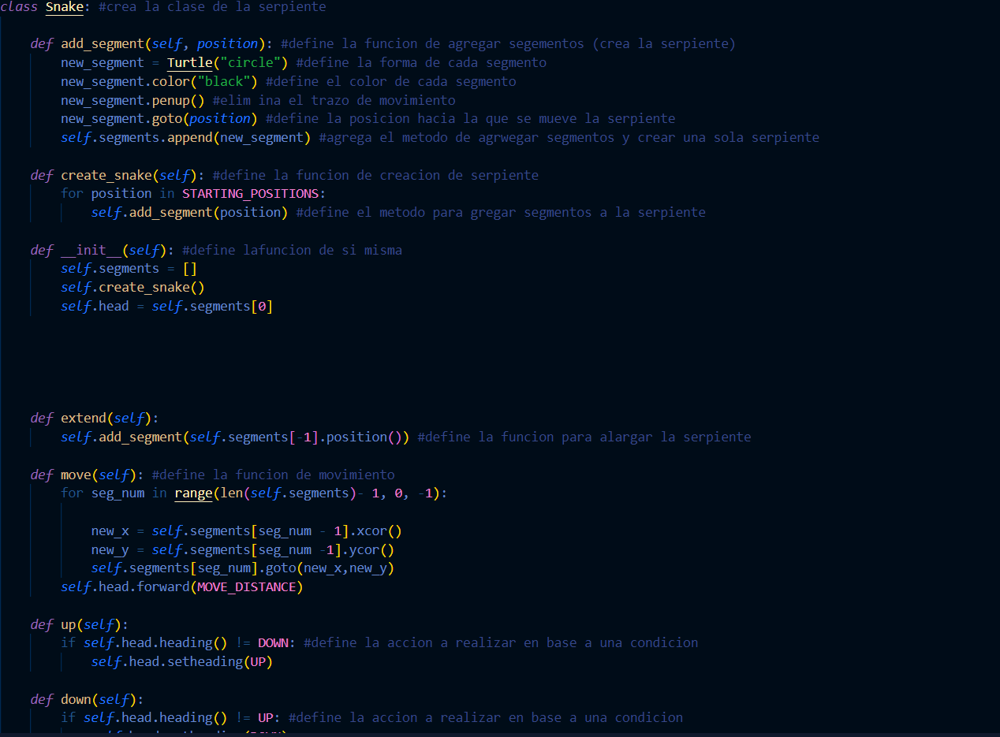

 <h1>JUEGO SNAKE</h1> 

<h2>EXPLICACON DE PROYECTO</h2>

El videougo <b>"SNAKE"</b> fue desarrollado en 1976 por gremlin nokia para sus dispositivos android, esta vez replicaremos dicho juego en el lenguaje python

<h2>Creacion del proyecto</h2>

Para la creacion de este proyecto iniciaremos por crear una carpeta madre llamada "SNAKE" en la cual encontraremos los codigos funcionales, un readme y una carpeta con imagenes

<h3>Archivos</h3>
<li>main.py
<li>food.py
<li>scoreboard.py
<li>snake.py

<h2>Main.py</h2>

En este archivo se inicializaran las tareas principales, será la cabeza principal del juego, donde estará la logica del mismo y su interfaz, iniciamos con unas importaciones

<ol>
<li>
En primer lugar tenemos turtle como libreria, esto nos permite crear la pantala en la que se observarán los sucesos, lo que viene siendo la interfaz

<li>
Los siguientes dos imports se importa las clases correspondientes( Snake,Food,Scoreboard ) de los archivos correspondientes 

<li>
Por ultimo se importa la libreria time permite reconocer el tiempo real desde el inicio hasta el final del juego

<h3>Ventana

 En esta seccion se definen los parametros de la interfaz o pantalla principal

<h3>Funcion Principal

En esta seccion se definen todas las funciones basicas para el correcto desempeño del programa

<h2> Food.py

 en ete archivo se definiran los atributos o funciones referentes a la comida de la serpiente, para esto al igual que en el anterior se debn de importar archivos

 

 en primer lugar se immporta Turtle para el grafico de la comida y luego se importa random para la aparicion aleatoria de la comida

<H3>Clase y atributos

 se definen los atributos de la comida en si misma como su reaparicion , forma, color, entre otros

<h2>Scoreboard.py

 en este archivo se define la funcionalidad de el marcador y su apariencia, en este caso solo se importa turtle para su aparicion grafica

<h3>Formato

 se define la ubicacion del objeto o programa y su fuente 

<h3> Funcionalidad

Se deinen los parametros de la clase marcador y se crean las funciones necesarias para su correcto funcionamiento 

<H2>Snake.py

 En este archivo se define todo lo relacionado con la serpiente en si misma, su forma, color y lo mas importante, su movimiento, de igual forma a lo anterior se importa turtle para generar los graficos

<h3> Variables

Define lo necesario para el movimiento de la serpiente

<h3> Clase y movimiento

 en esta parte del codigo se define las funciones con condiciones al igual que las funciones de extender al momento de entrar en contacto con la comida, es la parte esencial del juego

 con esto finalizado el juego funciona correctamente.

